# WalkScapes &copy;

**A pedestrain perspective urban dataset from multiple cities across Poland desgined for semantic segmentation**

### Useful Links
* **[Read the Paper](LINK_TO_PAPER)**
* **[Download the Dataset](https://github.com/KNSyNAPS-org/walkscapes-dataset-data)**

---

## Introduction and Motivation

One of the fastest-growing areas of machine learning is real-time image segmentation. Many researchers view it as a key enabling technology for autonomous vehicles and, as a result, focus primarily on the road perspective, devoting substantial time and effort to building large, segmented datasets that depict the busy streets of major cities around the world.

This road-centric view largely dominates dataset creation, with only a few exceptions—primarily small datasets produced as technology demonstrations. Far fewer efforts address the need for a dedicated dataset that captures the challenges of image segmentation from a pedestrian perspective. Such a dataset can enable assistive navigation applications for blind and low-vision individuals (e.g., smartphone- and wearable-based guidance), with additional uses in pedestrian-oriented robotics and urban accessibility analytics.

For these reasons, we argue that there is a need for at least a medium-sized, segmented dataset from a pedestrian perspective. Although such a dataset may not be large enough to serve as a standalone training corpus, it can provide a valuable resource for fine-tuning models specifically designed for sidewalk image segmentation.

---

## Dataset Characteristics

Our dataset consists of 1,503 manually segmented images containing 14 classes representing various important elements of street enviroment. Images were taken across ten different cities in Poland, with most captured in Warsaw. Images were collected between July 2024 and Feburary 2025 so dataset represents few different seasons. Capturing occured during varying times of the day to diversify illumination and improve generalisation.

There were not many images showing severe weather phenomena. Some of the images were taken in series and, despite discarding identical photos, a considerable portion still exhibits similarities. This should be taken into account when designing a custom dataset split.

For that reason we reccommend using split proposed by us containing test split (70% - 1057 images), validation split (15% - 224 images) and test split (15% - 222 images).

All photos were captured using smartphone cameras. Because the devices were not standardized, the dataset spans a wide range of native resolutions, ranging from $864\times1920$ to $3213\times5712$ pixels. However, over 80\% of photos taken feature 5 resolutions ($2592\times4608$, $1536\times2048$, $3072\times4096$, $864\times1920$ and $1080\times1920$ pixels). Only data formats that were used comprise JPEG and PNG.

---

## Classes and Annotations

The dataset distinguishes 14 classes. The table below provides their names, descriptions and example images.

<table>
  <thead>
    <tr>
      <th width="10%">Class Name</th>
      <th width="45%">Description</th>
      <th width="45%">Image Example</th>
    </tr>
  </thead>
  <tbody>
    <tr>
      <td><b>Water</b></td>
      <td>Natural or artificial bodies of water such as rivers, lakes, ponds, or canals visible on the ground surface.</td>
      <td nowrap>
        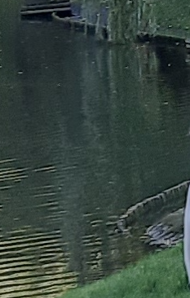
        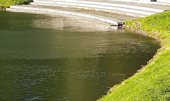
        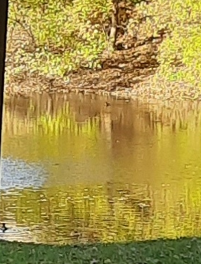
      </td>
    </tr>
    <tr>
      <td><b>Train</b></td>
      <td>Rail-bound vehicles used for public or cargo transportation, typically visible on train tracks or in railway stations.</td>
      <td nowrap>
        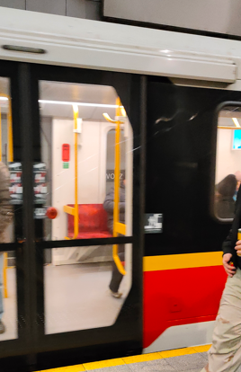
        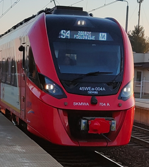
        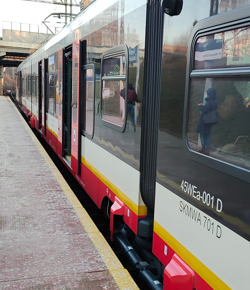
      </td>
    </tr>
    <tr>
      <td><b>Animal</b></td>
      <td>Non-human medium to large-sized animals that may appear in urban or rural environments, such as dogs. Small animals, such as birds or rodents, are not included.</td>
      <td nowrap>
        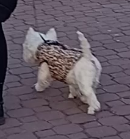
        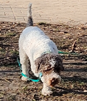
        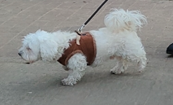
      </td>
    </tr>
    <tr>
      <td><b>Zebra</b></td>
      <td>Painted pedestrian crossings on roads, marked with alternating light and dark stripes to guide pedestrian movement.</td>
      <td nowrap>
        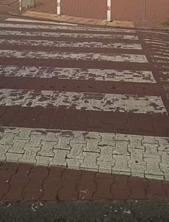
        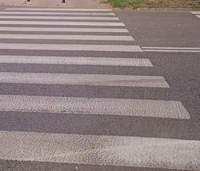
        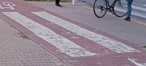
      </td>
    </tr>
    <tr>
      <td><b>Bike path</b></td>
      <td>Designated lanes, paths, or crossings intended for bicycle traffic, including roadside bike lanes and marked bicycle crossings through intersections or streets, often separated from motor vehicle lanes where possible.</td>
      <td nowrap>
        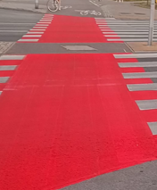
        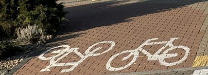
        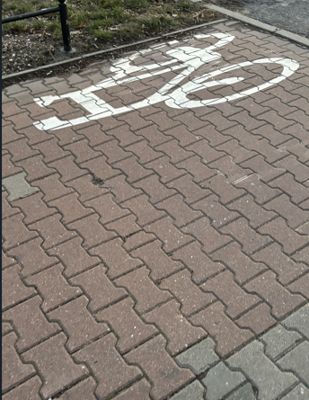
      </td>
    </tr>
    <tr>
      <td><b>Vegetation</b></td>
      <td>Areas covered with plant life such as bushes, shrubs, flowers, or trees, whether natural or cultivated.</td>
      <td nowrap>
        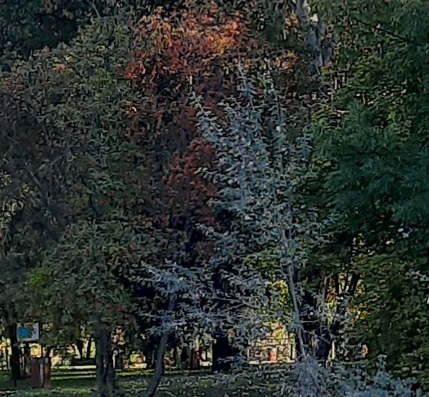
        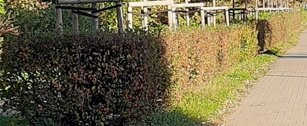
        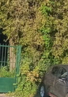
      </td>
    </tr>
    <tr>
      <td><b>Vehicle</b></td>
      <td>Motorized and non-motorized transport units operating on roads, including cars, trucks, buses, vans, bicycles, and scooters, visible from the exterior.</td>
      <td nowrap>
        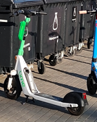
        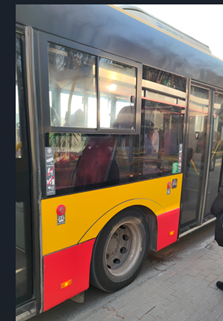
        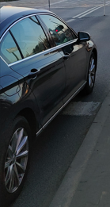
      </td>
    </tr>
    <tr>
      <td><b>Person</b></td>
      <td>Humans visible in the scene, either walking, standing, sitting, or performing other activities, regardless of age or clothing.</td>
      <td nowrap>
        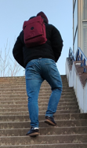
        
        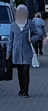
      </td>
    </tr>
    <tr>
      <td><b>Sky</b></td>
      <td>Visible portion of the atmosphere above the horizon, including clouds or variations in lighting such as sunrise or sunset.</td>
      <td nowrap>
        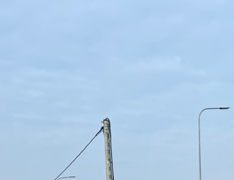
        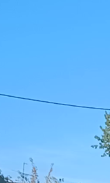
        
      </td>
    </tr>
    <tr>
      <td><b>Ground</b></td>
      <td>Natural earth surfaces such as soil, sand, gravel, or unpaved areas not intended for regular pedestrian or vehicle use. This includes grassy areas and surfaces covered with fallen leaves.</td>
      <td nowrap>
        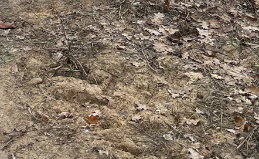
        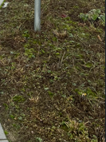
        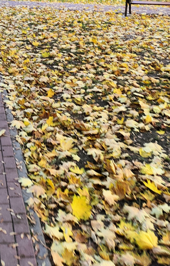
      </td>
    </tr>
    <tr>
      <td><b>Obstacle</b></td>
      <td>Uncategorized objects that obstruct movement or visibility, including construction barriers, temporary roadblocks, debris, poles (e.g., utility or sign poles), street furniture, and other objects not assigned to other classes. This class also includes strollers.</td>
      <td nowrap>
        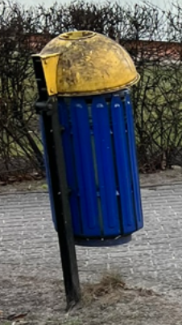
        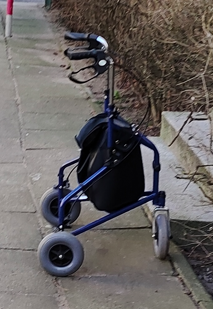
        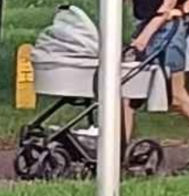
      </td>
    </tr>
    <tr>
      <td><b>Wall</b></td>
      <td>Vertical constructed surfaces forming the sides of buildings, fences, or standalone structures, including brick, concrete, stone, wooden, or painted walls and barriers, that cannot be easily bypassed.</td>
      <td nowrap>
        
        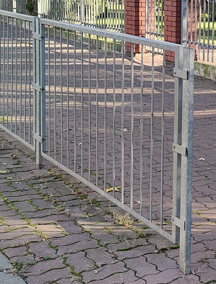
        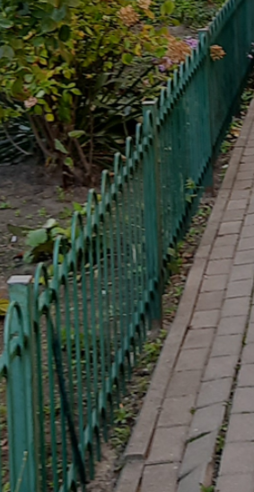
      </td>
    </tr>
    <tr>
      <td><b>Sidewalk</b></td>
      <td>Paved pedestrian paths alongside roads, usually elevated or separated from vehicle lanes by curbs or markings. Includes connected pedestrian stairs or steps that are part of the walkway infrastructure, as well as driveway aprons or curb cuts where vehicles may cross the sidewalk to access private property.</td>
      <td nowrap>
        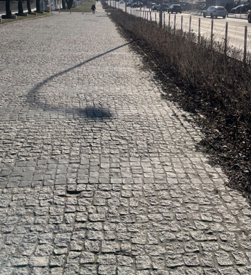
        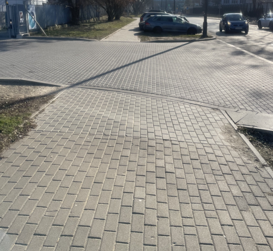
        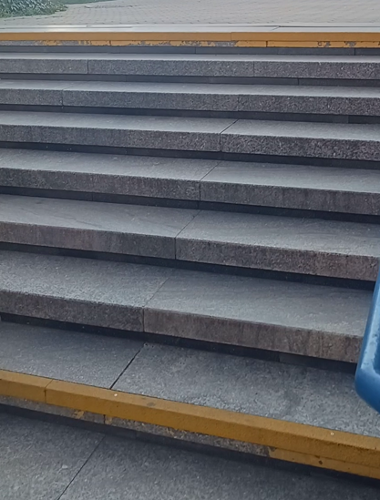
      </td>
    </tr>
    <tr>
      <td><b>Road</b></td>
      <td>Paved or unpaved surfaces designated for motor vehicle traffic, including lanes, intersections, road shoulders, parking areas, and both embedded and standalone railway tracks that are part of the traffic environment.</td>
      <td nowrap>
        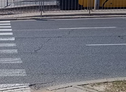
        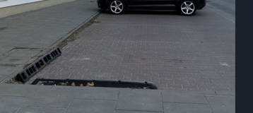
        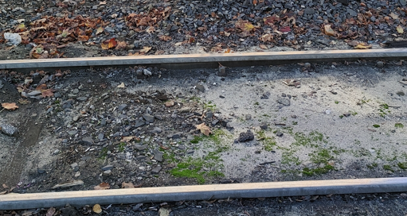
      </td>
    </tr>
  </tbody>
</table>

---

## Cityscapes Standard Mapping

For convienient transfer learning and creating benchmarks against models trained on classic driving datasets, we provide an official mapping of our classes to the Cityscapes dataset (<a href="https://www.cityscapes-dataset.com/">https://www.cityscapes-dataset.com/</a>). Several original classes have been merged to simplify the segmentation task, while new specific classes (such as *Bike path*, *Zebra*, *Animal*, and *Water*) have been introduced. Original classes mapped to ID `255` are designated as **Void** and are ignored during training and evaluation.

| Cityscapes ID | Cityscapes Class | Our ID | Our Class | Mapping Notes & Description |
| :---: | :--- | :---: | :--- | :--- |
| 0 | `unlabeled` | 255 | **Void** | Originally unlabeled areas. |
| 1 | `ego vehicle` | 255 | **Void** | The vehicle capturing the image (e.g., hood/camera mount). |
| 2 | `rectification border` | 255 | **Void** | Image rectification artifacts at the borders. |
| 3 | `out of roi` | 255 | **Void** | Regions outside the defined Region of Interest (ROI). |
| 4 | `static` | 255 | **Void** | Generic static objects not fitting any specific class. |
| 5 | `dynamic` | 255 | **Void** | Generic dynamic objects not fitting any specific class. |
| 6 | `ground` | 1 | **Sidewalk** | Shared spaces and pedestrian zones treated as drivable/walkable sidewalks. |
| 7 | `road` | 0 | **Road** | Standard driving lanes. |
| 8 | `sidewalk` | 1 | **Sidewalk** | Standard pedestrian sidewalks. |
| 9 | `parking` | 0 | **Road** | Parking areas, treated as part of the drivable road space. |
| 10 | `rail track` | 0 | **Road** | Tram or rail tracks embedded in or near the road surface. |
| 11 | `building` | 2 | **Wall** | Buildings mapped to the broader vertical structure category. |
| 12 | `wall` | 2 | **Wall** | Standard walls and vertical barriers. |
| 13 | `fence` | 2 | **Wall** | Fences mapped to the solid vertical structure category. |
| 14 | `guard rail` | 3 | **Obstacle** | Guard rails treated as generic obstacles. |
| 15 | `bridge` | 2 | **Wall** | Bridges mapped to the vertical structure category. |
| 16 | `tunnel` | 255 | **Void** | Tunnels are excluded/ignored in this dataset. |
| 17 | `pole` | 3 | **Obstacle** | Utility poles, signposts, and advertising pillars. |
| 18 | `polegroup` | 3 | **Obstacle** | Clusters of poles. |
| 19 | `traffic light` | 3 | **Obstacle** | Traffic lights mapped to generic obstacles. |
| 20 | `traffic sign` | 3 | **Obstacle** | Traffic signs mapped to generic obstacles. |
| 21 | `vegetation` | 8 | **Vegetation** | Trees, bushes, and other plant life. |
| 22 | `terrain` | 4 | **Ground** | Grass, soil, and natural terrain. |
| 23 | `sky` | 5 | **Sky** | Visible sky. |
| 24 | `person` | 6 | **Person** | Pedestrians. |
| 25 | `rider` | 6 | **Person** | Riders of bicycles or motorcycles mapped to the generic person class. |
| 26 | `car` | 7 | **Vehicle** | Cars. |
| 27 | `truck` | 7 | **Vehicle** | Trucks. |
| 28 | `bus` | 7 | **Vehicle** | Buses. |
| 29 | `caravan` | 7 | **Vehicle** | Caravans and RVs. |
| 30 | `trailer` | 7 | **Vehicle** | Trailers. |
| 31 | `train` | 12 | **Train** | Trains and trams. |
| 32 | `motorcycle` | 7 | **Vehicle** | Motorcycles. |
| 33 | `bicycle` | 7 | **Vehicle** | Bicycles. |
| -1 | `license plate` | 255 | **Void** | Obscured or blurred license plates. |
| - | - | 9 | **Bike path** | *New Class:* Designated bike lanes and paths. |
| - | - | 10 | **Zebra** | *New Class:* Painted pedestrian crossings. |
| - | - | 11 | **Animal** | *New Class:* Animals present in the traffic environment (e.g., dogs). |
| - | - | 13 | **Water** | *New Class:* Bodies of water (rivers, lakes, etc.). |

---

## Examples (Images and Masks)

Below are sample images and their corresponding segmentation masks.

<table align="center">
  <tr>
    <td align="center">
      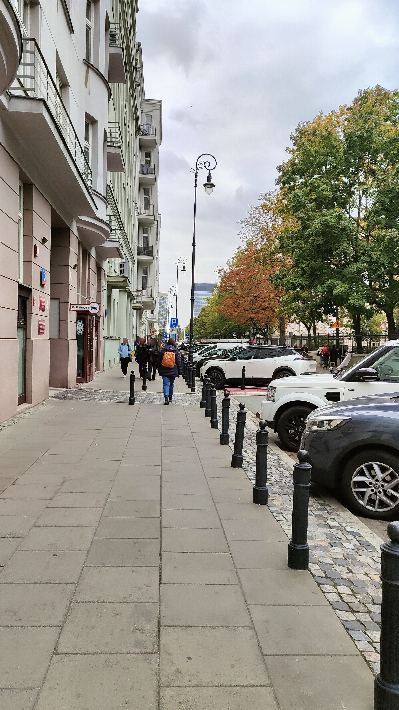 
      Original Image
    </td>
    <td align="center">
      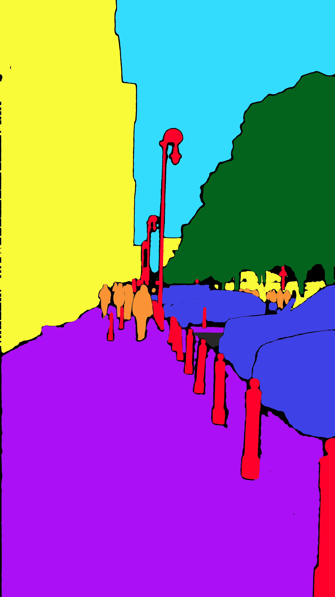 
      Segmentation mask
    </td>
  </tr>
  <tr>
    <td align="center">
      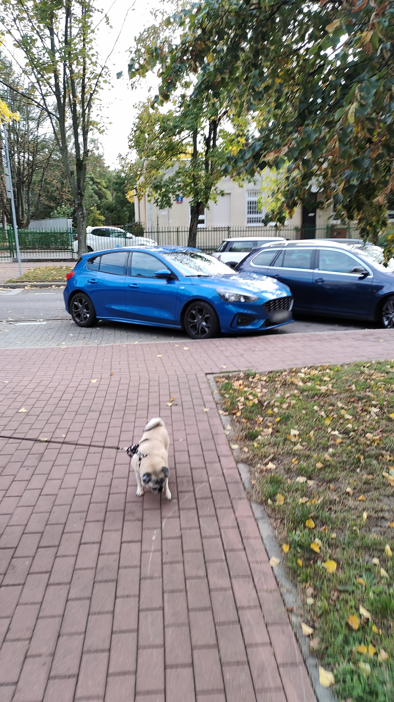 
      Original Image
    </td>
    <td align="center">
      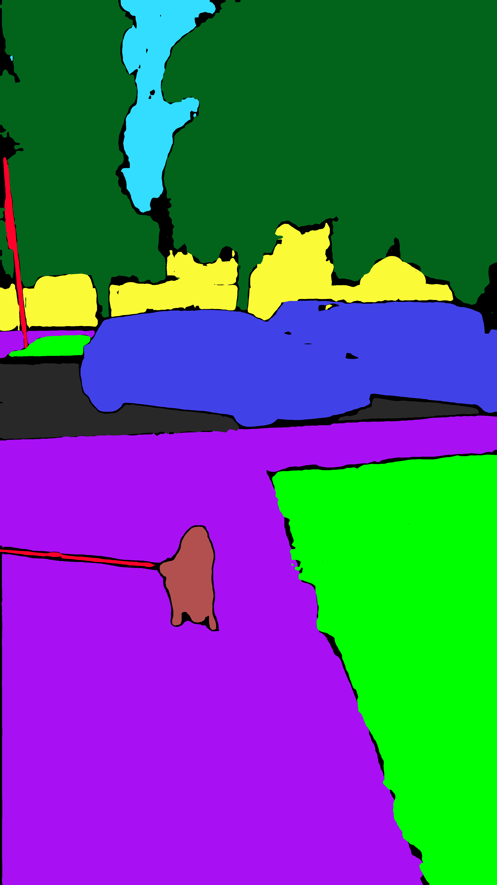 
      Segmentation mask
    </td>
  </tr>
  <tr>
    <td align="center">
      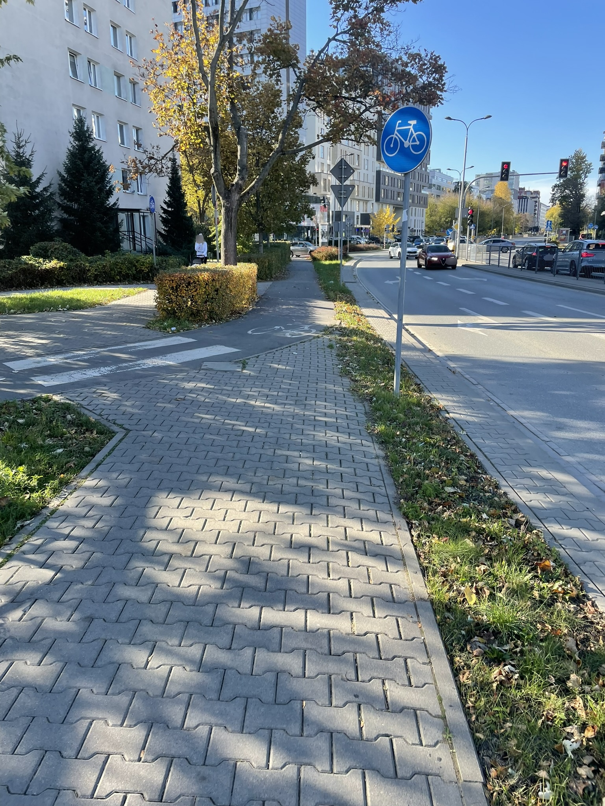 
      Original Image
    </td>
    <td align="center">
      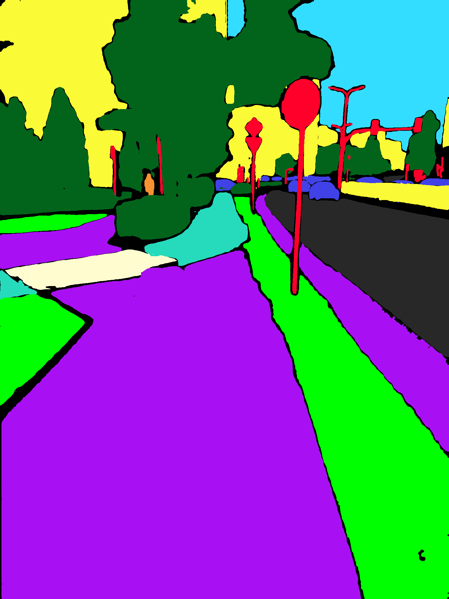 
      Segmentation mask
    </td>
  </tr>
  <tr>
    <td align="center">
      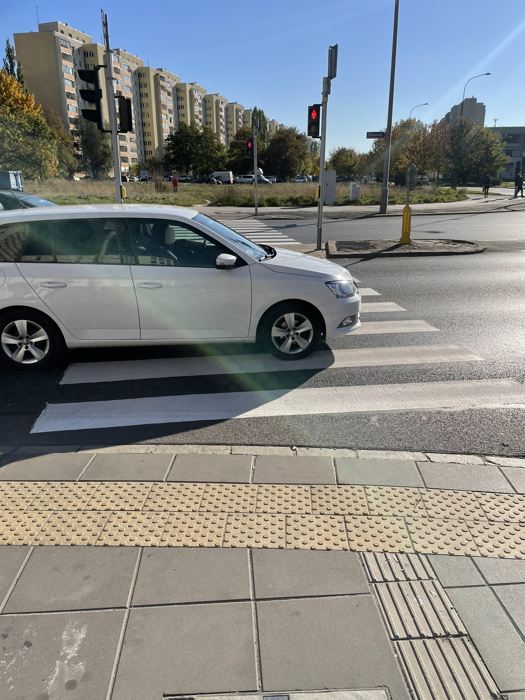 
      Original Image
    </td>
    <td align="center">
      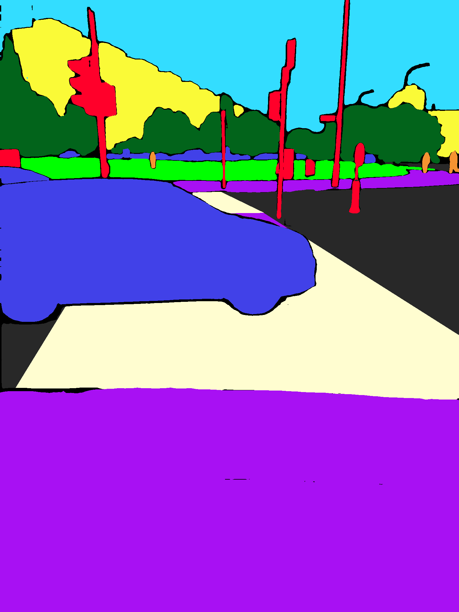 
      Segmentation mask
    </td>
  </tr>
  <tr>
    <td align="center">
      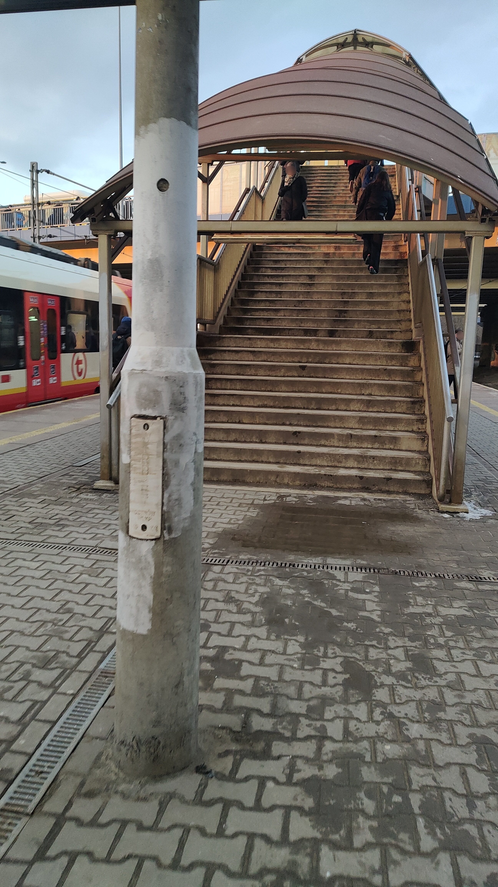 
      Original Image
    </td>
    <td align="center">
      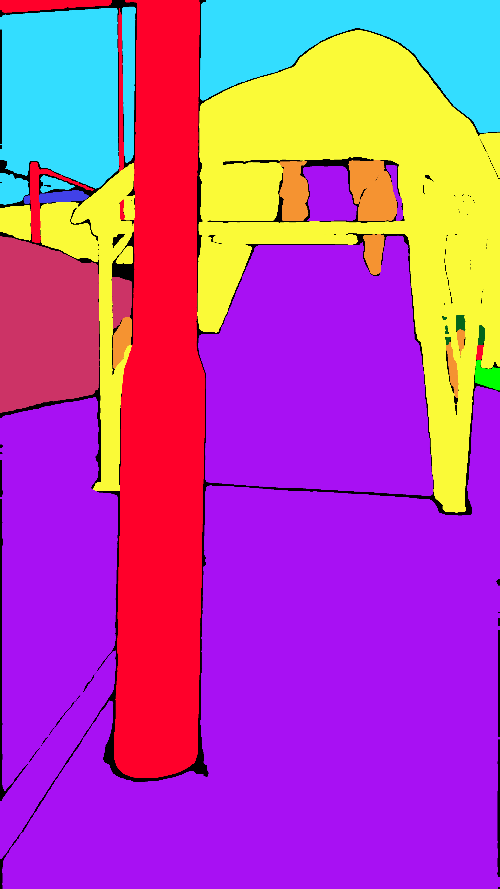 
      Segmentation mask
    </td>
  </tr>
  <tr>
    <td align="center">
      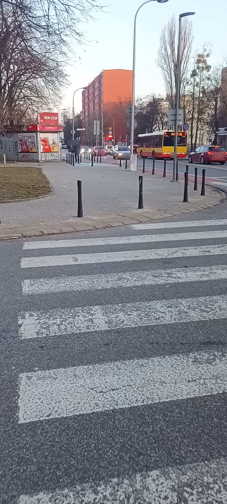 
      Original Image
    </td>
    <td align="center">
       
      Segmentation mask
    </td>
  </tr>
</table>

  <em>Examples of an images and a ground truth segmentation masks</em>

---

## License and Terms of Use
The **WalkScapes Dataset** is protected by copyright and is distributed under the **Creative Commons Attribution-NonCommercial 4.0 International (CC BY-NC 4.0)** license. 

This means you are free to use, share, and adapt the dataset for **non-commercial research and educational purposes**, provided you give appropriate credit to the authors. Commercial use of this dataset is strictly prohibited.

### Terms of Use (Addendum)
In addition to the primary CC license, the use of this dataset is strictly governed by our specific Terms of Use. By downloading or using the data, you agree to these terms, which include critical restrictions on:
* **Privacy and Ethics:** Strict prohibition against re-identification, surveillance, tracking, or profiling of individuals.
* **Redistribution:** Rules on how to share modified or unmodified data.

Please read the full **[Terms of Use](TERMS_OF_USE.md)**, **[Ethical Use Guidelines](ETHICAL_USE_GUIDELINES.md)** and the **[LICENSE](LICENSE)** file carefully before downloading or using the data.

## Citation

If you use this dataset in your research, please cite our paper:
